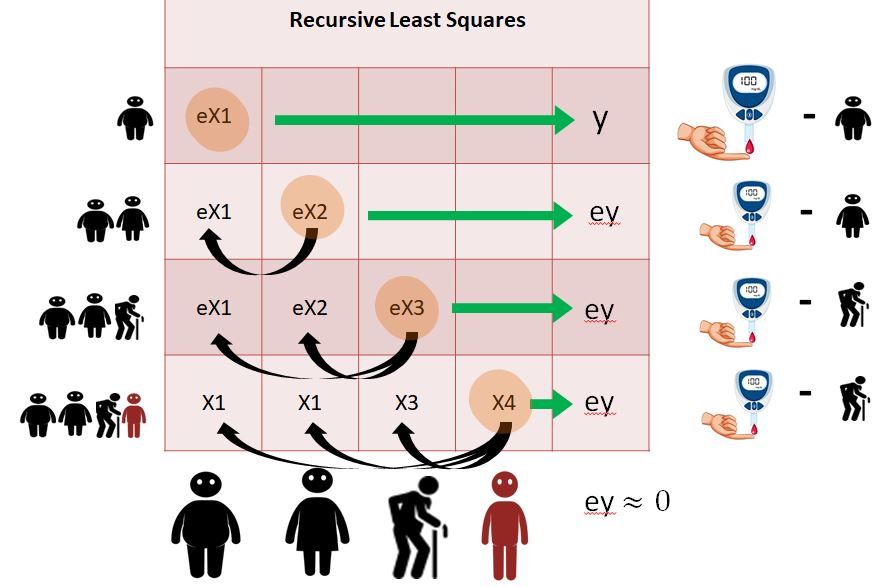

# Recursive Least Squares by predicting errors
This is a simple intivitve operation to estimate least squares for multiple variables 

Associated video tutorial is here: https://youtu.be/4vGaN1dTVhw

Inspired by the following post from the user: whuber (on stackexchange.com):
https://stats.stackexchange.com/q/166718

# Illustration: RLS Error Prediction

